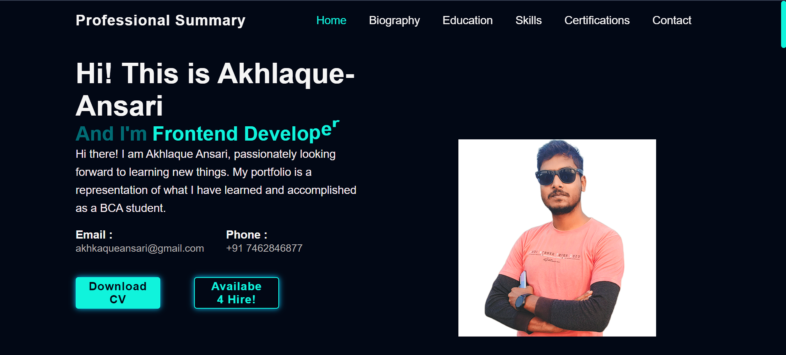
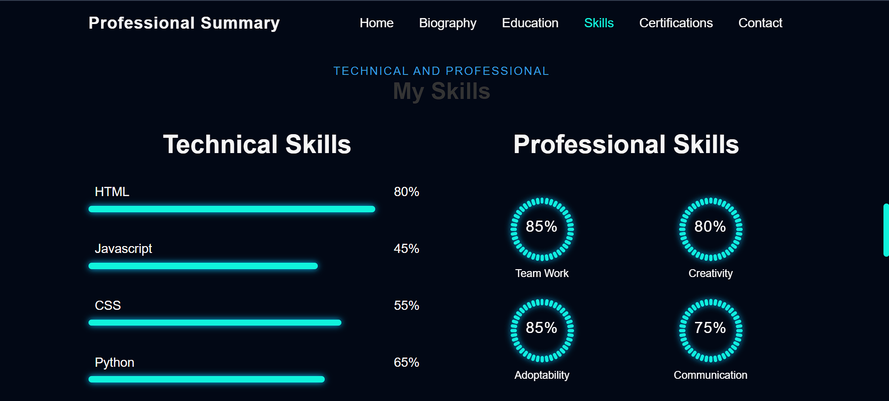

# Showcase Portfolio

Welcome to my Showcase Portfolio! This project is a personal portfolio website built using HTML5, CSS3, and JavaScript. It provides detailed information about my education, skills, and projects.

## Table of Contents

- [About the Project](#about-the-project)
- [Features](#features)
- [Technologies Used](#technologies-used)
- [Installation](#installation)
- [Usage](#usage)
- [Contact](#contact)

## Screenshots




## About the Project

This portfolio is designed to showcase my skills and experience as a web developer. It includes sections about my education, the skills I have acquired, and the projects I have worked on. The website features a clean, modern design with smooth animations and a responsive layout.

## Features

- **Responsive Design:** The layout adjusts smoothly to different screen sizes.
- **Animations:** Enhanced user experience with CSS animations.
- **Boxicons:** Elegant icons to improve visual appeal.
- **Detailed Information:** Sections for education, skills, and projects.

## Technologies Used

- **HTML5:** For the structure of the website.
- **CSS3:** For styling and animations.
- **JavaScript:** For interactivity and dynamic content.
- **Boxicons:** For icons.

## Installation

To run this project locally, follow these steps:

1. Clone the repository:
   ```bash
   git clone https://github.com/akhl1234/Akhlaque-Ansari.git
   ```
